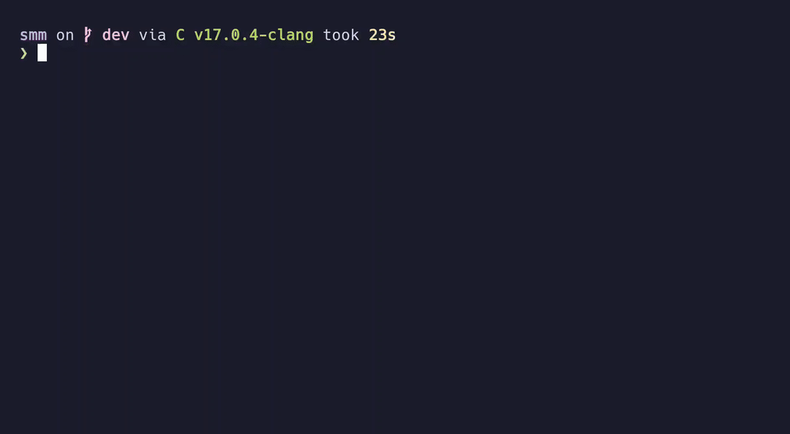

# Simple(Stupid) Matrix Multiplier

Simple matrix multiplier is a tui C program for all things matrix.
(At least that's what its trying to be)

# What's done ?

Currently the UI is almost done, the matrix window and the main window are
finished. We can navigate between the matrix window and main window and between
different matrices. But currently `smm` don't have any way to take user input to
modify the values in each matrices.

## Demo

Still in wip though
